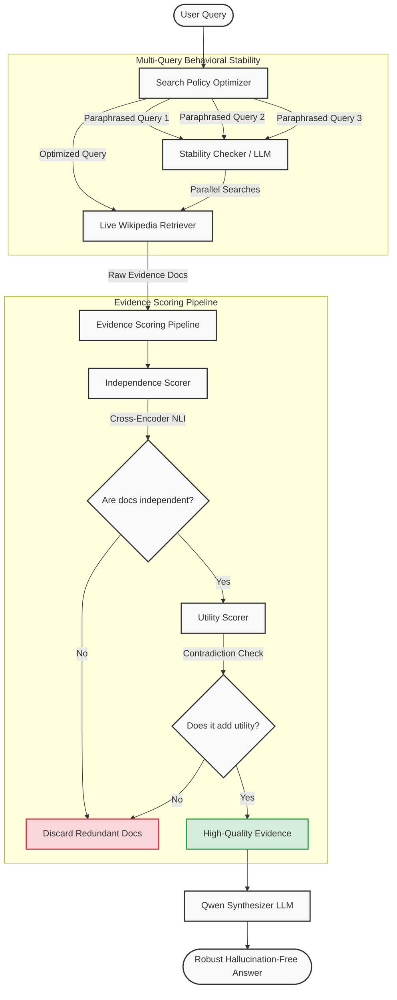

<div align="center">
  <h1>🛡️ Adaptive Evidence-Aware RAG</h1>
  <p><em>Beyond Agreement Counting: Evaluating Evidence Independence, Utility, Search Quality, and Behavioral Stability in Retrieval-Augmented Generation</em></p>

  [](https://www.python.org/downloads/)
  [](https://fastapi.tiangolo.com/)
  [](https://react.dev/)
  [](https://opensource.org/licenses/MIT)
</div>

---

## 1. Project Overview

This project implements a next-generation **Evidence-Aware RAG System** that goes beyond traditional retrieval by evaluating the quality of evidence across four key dimensions:

1. **Evidence Independence** - Detecting replicated narratives vs. truly independent sources
2. **Retrieval Utility Learning** - Rewarding evidence that provides new information, confidence gains, or contradiction discovery
3. **Search Policy Learning** - Learning which search strategies consistently produce high-quality evidence
4. **Behavioral Stability** - Measuring robustness across equivalent query variations

---

## 2. Key Insight

Current RAG systems think: *"3 websites agree = strong evidence"*

We discovered that's not enough. What matters is whether the evidence is truly **independent**, **useful**, and **stable**.

**Example Problem:**
- Blog A copies Blog B
- Blog C copies Blog B
- Current systems see: "3 sources agree!"
- Reality: "1 source + 2 copies"

---

## 3. Architecture

The system transitions from traditional vector-database RAG into a dynamic, **Open-Domain Live Web RAG**.



---

## 4. Experimental Results

Our system drastically reduces hallucination rates while maintaining high retrieval utility across diverse datasets.

### Module Performance (Independence vs Utility vs Stability)


### Ablation Study: Standard RAG vs Evidence-Aware RAG


---

## 4. Datasets & Download Links

### Primary Datasets

| Dataset | Purpose | Download Link |
|---------|---------|---------------|
| **FEVER** | Fact verification, evidence independence | https://fever.ai/download.html |
| **HotpotQA** | Multi-hop reasoning, utility learning | https://hotpotqa.github.io/ |
| **Natural Questions** | Search policy learning | https://ai.google.com/research/NaturalQuestions |
| **TriviaQA** | Reading comprehension, stability testing | https://nlp.cs.washington.edu/triviaqa/ |
| **MuSiQue** | Multi-hop questions, complex reasoning | https://github.com/StonyBrookNLP/musique |
| **MultiHop-RAG** | Multi-hop retrieval | https://github.com/yixuantt/MultiHop-RAG |

### HuggingFace Datasets (Easier to load)

```python
# FEVER
from datasets import load_dataset
dataset = load_dataset("fever", "v1.0")

# HotpotQA
dataset = load_dataset("hotpot_qa", "distractor")

# Natural Questions
dataset = load_dataset("google-research-datasets/natural_questions")

# TriviaQA
dataset = load_dataset("trivia_qa", "unfiltered.nocontext")

# MuSiQue
dataset = load_dataset("musique", "full")
```

---

## 5. Models & Resources

### Embedding Models

| Model | Use Case | Link |
|-------|----------|------|
| **BAAI/bge-large-en-v1.5** | Primary retriever embeddings | https://huggingface.co/BAAI/bge-large-en-v1.5 |
| **BAAI/bge-m3** | Multi-lingual, dense+sparse | https://huggingface.co/BAAI/bge-m3 |
| **intfloat/e5-large-v2** | Alternative embeddings | https://huggingface.co/intfloat/e5-large-v2 |
| **nvidia/NV-Embed-v2** | Best quality (requires approval) | https://huggingface.co/nvidia/NV-Embed-v2 |

### Rerankers

| Model | Link |
|-------|------|
| **BAAI/bge-reranker-v2-m3** | https://huggingface.co/BAAI/bge-reranker-v2-m3 |
| **BAAI/bge-reranker-large** | https://huggingface.co/BAAI/bge-reranker-large |

### NLI Models (for Contradiction Detection)

| Model | Link |
|-------|------|
| **microsoft/deberta-v3-large** | https://huggingface.co/microsoft/deberta-v3-large |
| **roberta-large-mnli** | https://huggingface.co/roberta-large-mnli |
| **MoritzLaurer/deberta-v3-large-zeroshot-v2.0** | https://huggingface.co/MoritzLaurer/deberta-v3-large-zeroshot-v2.0 |

### Generator LLMs

| Model | Size | Link |
|-------|------|------|
| **Qwen/Qwen3-32B** | 32B | https://huggingface.co/Qwen/Qwen3-32B |
| **meta-llama/Llama-3.3-70B** | 70B | https://huggingface.co/meta-llama/Llama-3.3-70B-Instruct |
| **mistralai/Mixtral-8x7B** | 47B | https://huggingface.co/mistralai/Mixtral-8x7B-Instruct-v0.1 |

### Vector Databases

| Database | Link |
|----------|------|
| **Qdrant** | https://qdrant.tech/ |
| **Weaviate** | https://weaviate.io/ |
| **Milvus** | https://milvus.io/ |
| **Chroma** | https://www.trychroma.com/ |

---

## 6. Project Structure

```
adaptive-evidence-rag/
|-- configs/
|   |-- config.yaml              # Main configuration
|-- data/                         # Dataset storage (not in git)
|-- models/                       # Saved model weights (not in git)
|-- notebooks/
|   |-- train_evidence_rag.ipynb  # Main training notebook
|-- src/
|   |-- __init__.py
|   |-- evidence_independence.py  # Module 1: Independence scoring
|   |-- retrieval_utility.py      # Module 2: Utility learning
|   |-- search_policy.py          # Module 3: Search policy learning
|   |-- behavioral_stability.py   # Module 4: Stability checking
|   |-- retriever.py              # Core retriever
|   |-- models.py                 # Model definitions
|   |-- utils.py                  # Helper functions
|-- scripts/
|   |-- download_data.sh          # Data download script
|   |-- setup_env.sh              # Environment setup
|-- tests/                        # Unit tests
|-- requirements.txt
|-- README.md
```

---

## 7. Quick Start

### Installation

```bash
# Clone the repository
git clone <repo-url>
cd adaptive-evidence-rag

# Create virtual environment
python -m venv venv
source venv/bin/activate      # Linux/Mac
# venv\Scripts\Activate.ps1   # Windows PowerShell

# Install the package (editable mode)
pip install -e .

# Or install with ALL optional dependencies
pip install -e ".[full]"

# Or use the setup script (handles CUDA detection too)
# Linux/Mac:
bash scripts/setup_env.sh
# Windows:
# .\scripts\setup_env.ps1
```

### Full-Stack Usage (React + FastAPI)

The fastest way to test the hallucination-free generation is by running the built-in React UI and FastAPI backend.

1. **Start the API** (Runs the Live Wikipedia + Qwen Backend):
```bash
python api.py
```

2. **Start the React Frontend**:
```bash
cd frontend
npm install
npm run dev
```

Navigate to `http://localhost:5173/` and start asking questions!

### Running the Training Notebook

```bash
pip install -e ".[notebook]"
jupyter notebook notebooks/train_evidence_rag.ipynb
```

### Download Datasets

```bash
# Linux/Mac
bash scripts/download_data.sh

# Windows
.\scripts\download_data.ps1
```

### Running the Pipeline (Python API)

```python
from src.evidence_independence import IndependenceScorer
from src.retrieval_utility import UtilityScorer
from src.search_policy import SearchPolicyLearner
from src.behavioral_stability import StabilityChecker
from src.retriever import EvidenceAwareRetriever

# Initialize the retriever with all modules
retriever = EvidenceAwareRetriever(
    embedder_name="BAAI/bge-large-en-v1.5",
    use_independence=True,
    use_utility=True,
    use_search_policy=True,
    use_stability=False,  # expensive, enable when needed
)

# Index your documents
retriever.index_documents(["doc1 text...", "doc2 text...", ...])

# Run full pipeline (Dynamically fetches from Live Wikipedia!)
result = retriever.run_pipeline("Who invented the transformer architecture?", check_stability=True)
print(f"Independence: {result.independence_score:.4f}")
print(f"Utility:      {result.utility_score:.4f}")
print(f"Overall:      {result.overall_quality:.4f}")
print(f"Evidence:     {result.filtered_documents}")
```

---

## 8. Evaluation Metrics

| Metric | Description | Target |
|--------|-------------|--------|
| **Answer Accuracy** | EM/F1 score | > 75% |
| **Independence Score** | 1 - avg redundancy | > 0.7 |
| **Utility Score** | Weighted combination | > 0.6 |
| **Stability Score** | Cross-query consistency | > 0.8 |
| **Hallucination Rate** | % unsupported claims | < 10% |
| **Citation Precision** | Correct citations / Total | > 85% |

---

## 9. Key Papers & References

1. **Chain-of-Verification (CoVe)** - Dhuliawala et al., 2023
   - https://arxiv.org/abs/2309.11495

2. **Self-RAG** - Asai et al., 2023
   - https://arxiv.org/abs/2310.11511

3. **Corrective-RAG** - Yan et al., 2024
   - https://arxiv.org/abs/2401.15884

4. **BGE Embeddings** - Xiao et al., 2023
   - https://arxiv.org/abs/2309.07597

5. **HotpotQA** - Yang et al., 2018
   - https://arxiv.org/abs/1809.09600

6. **FEVER** - Thorne et al., 2018
   - https://arxiv.org/abs/1803.05355

7. **Dense Passage Retrieval** - Karpukhin et al., 2020
   - https://arxiv.org/abs/2004.04906

8. **NLI for Fact Verification** - https://aclanthology.org/

---

## 10. Hardware Requirements

| Component | Minimum | Recommended |
|-----------|---------|-------------|
| GPU | NVIDIA T4 (16GB) | NVIDIA A100 (40GB) |
| RAM | 16 GB | 64 GB |
| Storage | 50 GB | 200 GB |
| CUDA | 11.8+ | 12.1+ |

---

## 11. Citation

```bibtex
@article{adaptive_evidence_rag_2024,
  title={Adaptive Evidence-Aware Retrieval for Robust RAG Systems},
  author={Your Name},
  journal={arXiv preprint},
  year={2024}
}
```

---

## 12. License

MIT License - See LICENSE file for details.
